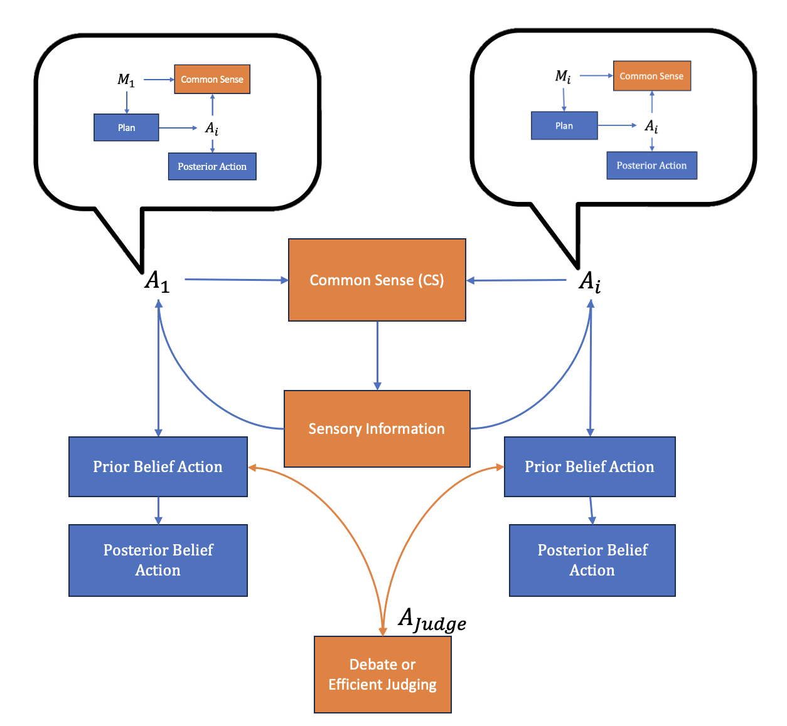
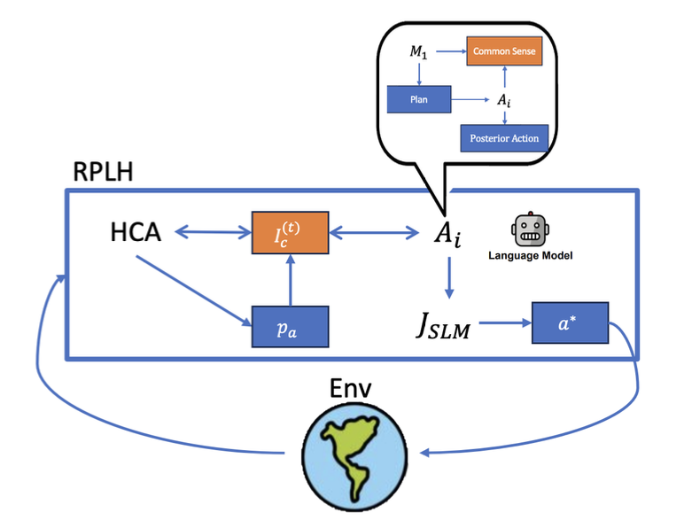
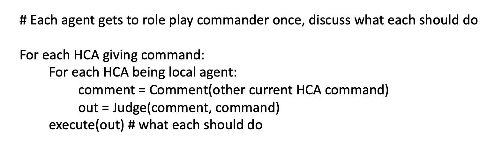

# Role-playing Leader-hellucination Agent
We are developing frameworks for multi-agent collaborations using **R**ole-**P**laying **L**eader-**H**ellucinating LLM, or in short, **RPLH-LLM**. We are currently developing on minimal example and we are planning to adapt to MCTS fine-tuned LLM with VirtualHome later.

## Simplified Schematic
<div align=center>

</div>

We hope to build agent that is caplable of ***Social-reasoning and expecting what the other agent should be doing***. We are building a generalize world model for every single agent in this environment and hopefully moving a step closer to ***Level-one agent***.

## Full Schematic
<div align=center>

</div>

## Main Loops
<div align=center>

</div>

## Communication Example

Example demonstrating the communication

```
HCA_0: 
 To optimize the movement and avoid getting stuck in loops, let's carefully select actions that move boxes closer to their corresponding targets:

- Agent at square[0.5, 0.5]: There is a `box_blue` here which can be moved towards its target.
- Agent at square[1.5, 0.5]: This agent also has another `box_blue`, and it should move this box closer to one of the blue targets.
- The other agents have green and purple boxes which are somewhat cluttered and not directly near their targets.

Given these observations:

- We'll prioritize moving blue boxes since there are two, ensuring they get moved towards targets first to prevent congestion at future steps.
- Then we can focus on the remaining colors as needed.

Thus, the next action plan will include moves for both blue boxes:

{
  "Agent[0.5, 0.5]": "move(box_blue, square[0.5, 1.5])",
  "Agent[1.5, 0.5]": "move(box_blue, square[1.5, 1.5])"
}

This plan ensures that two blue boxes are moved closer to their targets, with one moving horizontally and the other vertically, making efficient use of available moves while avoiding any immediate conflicts or loop conditions. 
 
LOCAL_0_ROW_0_COL_0: 
 Not Agree. The plan has Agent[1.5, 0.5] moving the blue box from their square to square [1.5, 1.5], but there is already a 'box_blue' in that target location as observed by Agent[0.5, 1.5]. This would result in a collision and no progress towards the goal of matching each box with its respective target. A better plan might involve moving the blue boxes directly to their targets or clearing space for them first if necessary. 
 
JUDGE_0_ROW_0_COL_0: 
 {"Agent[0.5, 0.5]":"move(box_blue, square[0.5, 1.5])", "Agent[1.5, 0.5]":"move(box_blue, target_blue)"} 
 
JUDGE_0_ROW_0_COL_1: 
 {"Agent[0.5, 0.5]":"move(box_blue, square[0.5, 1.5])", "Agent[1.5, 0.5]":"move(box_blue, target_blue)"} 
 
LOCAL_0_ROW_1_COL_0: 
 I Agree 
 
JUDGE_0_ROW_1_COL_0: 
 {"Agent[0.5, 0.5]":"move(box_blue, square[0.5, 1.5])", "Agent[1.5, 0.5]":"move(box_blue, target_blue)"} 
 
JUDGE_0_ROW_1_COL_1: 
 {"Agent[0.5, 0.5]":"move(box_blue, square[1.5, 1.5])", "Agent[1.5, 0.5]":"move(box_purple, square[0.5, 1.5])"} 
```

## Local Agent "Complainining" Example
This is an example of lcoal agent complaining of the action given by others

```
------###------###------HCA_0------###------###------: 
...
Considering these points:
{
    "Agent[0.5, 0.5]" : "",
    "Agent[0.5, 1.5]" : "move(box_blue, square[0.5, 0.5])",
    "Agent[1.5, 0.5]" : "move(box_red, target_red)",
    "Agent[1.5, 1.5]" : ""
}

------###------###------LOCAL_0_ROW_0_COL_0------###------###------: 
My objections are:
- The given action plan misses out on actions for Agent[0.5, 0.5], which includes myself.
- It's unclear how moving box_blue from square [0.5, 1.5] aligns with the observable list provided for that square in the context of coordinating all agents towards their respective targets.
...
{"Agent[0.5, 0.5]" : "move(box_orange, target_orange)"}

------###------###------JUDGE_0_ROW_0_COL_0------###------###------: 
 {"Agent[0.5, 0.5]":"move(box_orange, target_orange)"} 
 
------###------###------LOCAL_0_ROW_0_COL_1------###------###------: 
 I Agree

 ------###------###------JUDGE_0_ROW_0_COL_1------###------###------: 
 {"Agent[0.5, 0.5]":"move(box_orange, target_orange)"} 
 
------###------###------LOCAL_0_ROW_1_COL_0------###------###------: 
Not agreed. The current action plan only includes Agent[0.5, 0.5] moving the box_orange to its target, which was already executed in the previous step.
...
Proposed updated action plan:
{"Agent[1.5, 0.5]":"move(box_red, square[0.5, 0.5])"} 
```

## Setting Up
Install the dependencies by:
```
conda env create
```

Instantiate agent by:

```
ollama run qwen2.5:14b-instruct-q3_K_L
```

Then running main inference by:

```
python run_rplh.py
```

## TODO:
1. Make synthetic check better and re better for getting json format answer.
2. Try bigger models for base LLM
3. Adaptation to the VirtualHome environment
4. Use fine-tuned MCTS-World-Model LLM for task

## Adapting on:
1. https://yongchao98.github.io/MIT-REALM-Multi-Robot/
2. https://github.com/szxiangjn/world-model-for-language-model
